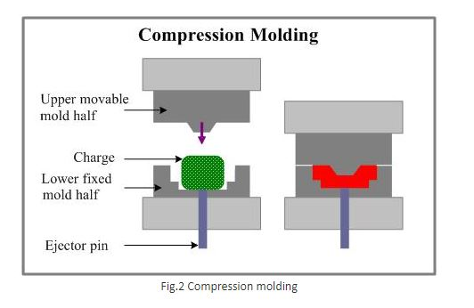

### Theory

**Molding:**

Molding is the process of manufacturing by shaping pliable raw material using a rigid frame or model called a pattern.
A mold is a hollowed-out block that is filled with a liquid like plastic, glass, metal, or ceramic raw materials. The liquid hardens or sets inside the mold, adopting its shape. A mold is the counterpart to a cast. The manufacturer who makes the molds is called the mold maker. A release agent is typically used to make removal of the hardened/set substance from the mold easier. Typical uses for molded plastics include molded furniture, molded household goods, molded cases, and structural materials.

**Types of molding include:**
1. Blow molding
2. Compression molding
3. Extrusion molding
4. Injection molding
5. Reaction injection molding
6. Transfer molding
7. Thermo forming,
8. Vacuum forming

**1) Blow Molding:**

Blow molding (also known as blow moulding or blow forming) is a manufacturing process by which hollow plastic parts are formed. In general, there are three main types of blow molding: extrusion blow molding, injection blow molding, and stretch blow molding. The blow molding process begins with melting down the plastic and forming it into a parison or preform. The parison is a tube-like piece of plastic with a hole in one end in which compressed air can pass through.
The parison is then clamped into a mold and air is pumped into it. The air pressure then pushes the plastic out to match the mold. Once the plastic has cooled and hardened the mold opens up and the part is ejected.

**2) Compression molding:**

Compression molding is a method of molding in which the molding material, generally preheated, is first placed in an open, heated mold cavity. The mold is closed with a top force or plug member, pressure is applied to force the material into contact with all mold areas, while heat and pressure are maintained until the molding material has cured. The process employs thermosetting resin in a partially cured stage, either in the form of granules, putty-like masses, or preforms. Compression molding is a high-volume, high-pressure method suitable for molding complex, high-strength fiberglass reinforcements. Advanced composite thermoplastic can also be compression molded with unidirectional tapes, woven fabrics, randomly oriented fiber mat or chopped strand. The advantage of compression molding is its ability to mold large, fairly intricate parts. Also, it is one of the lowest cost molding methods compared with other methods such as transfer molding and injection molding; moreover it wastes relatively little material, giving it an advantage when working with expensive compounds. However, compression molding often provides poor product consistency and difficulty in controlling flashing, and it is not suitable for some types of parts. Fewer knit lines are produced and a smaller amount of fiber-length degradation is noticeable when compared to injection molding. Compression-molding is also suitable for ultra-large basic shape production in sizes beyond the capacity of extrusion techniques.

**3) Extrusion molding:**

Extrusion is a process used to create objects of a fixed cross-sectional profile. A material is pushed or drawn through a die of the desired cross-section. The two main advantages of this process over other manufacturing processes are its ability to create very complex cross-sections and work materials that are brittle, because the material only encounters compressive and shear stresses. It also forms finished parts with an excellent surface finish.

Extrusion may be continuous (theoretically producing indefinitely long material) or semi-continuous (producing many pieces). The extrusion process can be done with the material hot or cold.

Commonly extruded materials include metals, polymers, ceramics and concrete. Hollow cavities within extruded material cannot be produced using a simple flat extrusion die, because there would be no way to support the centre barrier of the die. Instead, the die assumes the shape of a block with depth, beginning first with a shape profile that supports the centre section. The die shape then internally changes along its length into the final shape, with the suspended centre pieces supported from the back of the die.

**4) Injection molding:**

Injection molding is a manufacturing process for producing parts from both thermoplastic and thermosetting plastic materials. Material is fed into a heated barrel, mixed, and forced into a mold cavity where it cools and hardens to the configuration of the cavity. After a product is designed, usually by an industrial designer or an engineer, molds are made by a mold maker (or toolmaker) from metal, usually either steel or aluminium, and precision-machined to form the features of the desired part. Injection molding is widely used for manufacturing a variety of parts, from the smallest component to entire body panels of cars

**5) Reaction Injection Molding:**

Reaction injection molding (RIM) is similar to injection molding except thermosetting polymer are used, which requires a curing reaction to occur within the mold. Common items made via RIM include automotive bumpers, air spoilers, and fenders.
Process: First, the two parts of the polymer are mixed together. The mixture is then injected into the mold under high pressure using an impinging mixer. The mixture is allowed to sit in the mold long enough for it to expand and cure.
If reinforcing agents are added to the mixture then the process is known as reinforced reaction injection molding (RRIM). Common reinforcing agents include glass fibers and mica. This process is usually used to produce rigid foam automotive panels. A subset of RIM is structural reaction injection molding (SRIM),
which uses fiber meshes for the reinforcing agent. The fiber mesh is first arranged in the mold and then the polymer mixture is injection molded over it.
The most common RIM processable material is polyurethane (known generally as PU-RIM), but others include polyureas, polyisocyanurates, polyesters, polyphenols, polyepoxides, and nylon 6. For polyurethane one component of the mixture is polyisocyanate and the other component is a blend of polyol, surfactant, catalyst, and blowing agent

**6) Transfer molding:**

Transfer molding like compression molding, is a process where the amount of molding material (usually a thermoset plastic) is measured and inserted before the molding takes place. The molding material is preheated and loaded into a chamber known as the pot. A plunger is then used to force the material from the pot through channels known as a sprue and runner system into the mold cavities. The mold remains closed as the material is inserted and is opened to release the part from the sprue and runner. The mold walls are heated to a temperature above the melting point of the mold material; this allows a faster flow of material through the cavities.
Transfer Molding- This is an automated operation that combines compression-, molding, and transfer-molding processes. This combination has the good surface finish, dimensional stability, and mechanical properties obtained in compression molding and the high-automation capability and low cost of injection molding and transfer molding. Transfer Molding is having a "piston and cylinder"-like device built into the mold so that the rubber is squirted into the cavity through small holes. A piece of uncured rubber is placed into a portion of the transfer mold called the "pot." The mold is closed and under hydraulic pressure the rubber or plastic is forced through a small hole (the "gate") into the cavity. The mold is held closed while the plastic or rubber cures. The plunger is raised up and the "transfer pad" material may be removed and thrown away. The transfer mold is opened and the part can be removed. The flash and the gate may need to be trimmed. Another key point is that a premeasured amount of thermosetting plastic in powder, pre-form, and even granular form can be placed into the heating chamber.
The molds in both compression and transfer molding remain closed until the curing reaction within the material is complete. Ejector pins are usually incorporated into the design of the molding tool and are used to push the part from the mold once it has hardened. These types of molding are ideal for high production runs as they have short production cycles. Transfer molding, unlike compression molding uses a closed mold, so smaller tolerances and more intricate parts can be achieved. The fixed cost of the tooling in transfer molding is greater than in compression molding and as both methods produce waste material, whether it be flash or the material remaining in the sprue and runners, transfer molding is the more expensive process.

**7) Thermoforming:**

Thermoforming is a manufacturing process where a plastic sheet is heated to a pliable forming temperature, formed to a specific shape in a mold, and trimmed to create a usable product. The sheet, or "film" when referring to thinner gauges and certain material types, is heated in an oven to a high-enough temperature that it can be stretched into or onto a mold and cooled to a finished shape.
In its simplest form, a small table top or lab size machine can be used to heat small cut sections of plastic sheet and stretch it over a mold using vacuum. This method is often used for sample and prototype parts. In complex and high-volume applications, very large production machines are utilized to heat and form the plastic sheet and trim the formed parts from the sheet in a continuous high-speed process, and can produce many thousands of finished parts per hour depending on the machine and mold size and the size of the parts being formed.

Thermoforming differs from injection molding, blow molding, rotational molding, and other forms of processing plastics. Thin-gauge thermoforming is primarily the manufacture of disposable cups, containers, lids, trays, blisters, clamshells, and other products for the food, medical, and general retail industries. Thick-gauge thermoforming includes parts as diverse as vehicle door and dash panels, refrigerator liners, utility vehicle beds, and plastic pallets.
In the most common method of high-volume, continuous thermoforming of thin-gauge products, plastic sheet is fed from a roll or from an extruder into a set of indexing chains that incorporate pins, or spikes, that pierce the sheet and transport it through an oven for heating to forming temperature. The heated sheet then indexes into a form station where a mating mold and pressure-box close on the sheet, with vacuum then applied to remove trapped air and to pull the material into or onto the mold along with pressurized air to form the plastic to the detailed shape of the mold. (Plug-assists are typically used in addition to vacuum in the case of taller, deeper-draw formed parts in order to provide the needed material distribution and thicknesses in the finished parts.) After a short form cycle, a burst of reverse air pressure is actuated from the vacuum side of the mold as the form tooling opens, commonly referred to as air-eject, to break the vacuum and assist the formed parts off of, or out of, the mold. A stripper plate may also be utilized on the mold as it opens for ejection of more detailed parts or those with negative-draft, undercut areas. The sheet containing the formed parts then indexes into a trim station on the same machine, where a die cuts the parts from the remaining sheet web, or indexes into a separate trim press where the formed parts are trimmed. The sheet web remaining after the formed parts are trimmed is typically wound onto a take-up reel or fed into an inline granulator for recycling.
Most thermoforming companies recycle their scrap and waste plastic, either by compressing in a baling machine or by feeding into a granulator (grinder) and producing ground flake, for sale to reprocessing companies or re-use in their own facility. Frequently, scrap and waste plastic from the thermoforming process is converted back into extruded sheet for forming again.

**8) Vacuum forming :**

Vacuum forming is a simplified version of thermoforming, whereby a sheet of plastic is heated to a forming temperature, stretched onto or into a single-surface mould (BrE, mould), and held against the mould by applying a vacuum between the mould surface and the sheet. The vacuum forming process can be used to make most product packaging, speaker casings, and even car dashboards. The first commercial manufacturer of vacuum-formed plastics was Robinson Industries of Coleman, Michigan.
Normally, draft angles must be present in the design on the mold (a recommended minimum of 3°). Otherwise, release of the formed plastic and the mold will most likely be difficult.
Vacuum forming is usually, but not always, restricted to forming plastic parts that are rather shallow in depth. A thin sheet is formed into rigid cavities for unit doses of pharmaceuticals and for loose objects that are carded or presented as point-of-purchase items. Thick sheet is formed into permanent objects such as turnpike signs and protective covers.

Relatively deep parts can be formed if the form-able sheet is mechanically or pneumatically stretched prior to bringing it in contact with the mold surface and before vacuum is applied.
Suitable materials for use in vacuum forming are conventionally thermoplastics. The most common and easiest to use thermoplastic is High Impact Polystyrene Sheeting (HIPS). This is molded around a wood, structural foam or cast/machined aluminium mold and can form to almost any shape. Vacuum forming is also appropriate for transparent materials such as acrylic which are widely used in applications for aerospace such as passenger cabin window canopies for military fixed wing aircraft and "bubbles" for rotary wing aircraft.

**Casting:**

Casting is a manufacturing process by which a liquid material is usually poured into a mold, which contains a hollow cavity of the desired shape, and then allowed to solidify. The solidified part is also known as a casting, which is ejected or broken out of the mold to complete the process. Casting materials are usually metals or various cold setting materials that cure after mixing two or more components together; examples are epoxy, concrete, plaster and clay. Casting is most often used for making complex shapes that would be otherwise difficult or uneconomical to make by other methods.

**Types**

1. Metal working
2. Plaster, concrete, or plastic resin

**1) Metal working:**

In metalworking, casting involves pouring liquid metal into a mold, which contains a hollow cavity of the desired shape, and then allowing it to cool and solidify. The solidified part is also known as a casting, which is ejected or broken out of the mold to complete the process. Casting is most often used for making complex shapes that would be difficult or uneconomical to make by other methods.

**2)Plaster, concrete, or plastic resin:**

Plaster itself may be cast, as can other chemical setting materials such as concrete or plastic resin - either using single-use waste molds as noted above or multiple-use 'piece' molds, or molds made of small ridged pieces or of flexible material such as latex rubber (which is in turn supported by an exterior mold). When casting plaster or concrete, the finished product is, unlike marble, unattractive, lacking in transparency, and so it is usually painted, often in ways that give the appearance of metal or stone. Alternatively, the first layers cast may contain coloured sand so as to give an appearance of stone. By casting concrete, rather than plaster, it is possible to create sculptures, fountains, or seating for outdoor use. A simulation of high-quality marble may be made using certain chemically-set plastic resins (for example epoxy or polyester) with powdered stone added for coloration, often with multiple colours worked in. The latter is a common means of making attractive washstands, washstand tops and shower stalls, with the skilled working of multiple colours resulting in simulated staining patterns as is often found in natural marble.

**Die casting :**

Die casting is metal casting process that is characterized by forcing molten metal under high pressure into mold cavity. the mold cavity is created using two hardened tool steel dies which have been machined into shape and work similarly to an injection mold during the process. most die castings are made from non-ferrous metals, Specifically Zinc, copper, aluminium, magnesium, lead, pewter and tin based alloy, Depending on the type of metal being cast, a hot or cold Chamber machine is used.

The casting equipment and the metal dies represents large capital costs and this tends to limit the process to high volume production. Manufacture of part using die casting is relatively simple, involving only four main steps, Which keeps the incremental cost per item low.it is especially suited for a large quantity of small to medium sized casting, Which is why die casting produces more casting than any other casting process. Die casting is characterized by a very good surface finish(By casting standard) and dimensional consistency. two variants are pore free die casting, Which is used to eliminate gas porosity defects and direct injection die casting which is used with zinc casting to reduce scrap and increase yield.

**Sand casting:**

sand casting is also known as sand molded casting, is a metal casting process characterised by using sand as the mold material. The term sand casting can also refer to an object produced via the sand casting process.sand casting are produced in specialised factories called foundries.over 70% of all metal casting are produced via a sand casting process, sand casting is relatively cheap and Sufficiently refractory even for steel foundry use, in addition to the sand, a suitable bonding agent (usually clay) is mixed or occurs with the sand. the mixture is moistened with water to develop strength and plasticity of the clay and to make the aggregate suitable for molding.the sand is typically contained in a system of frames or mold boxes known as flask.the mold cavities and gate system are created by compacting the sand around models, or patterns, and carved directly into sand

Basic process There are six steps in this process:
1) Place a pattern in sand to create a mold.
2) Incorporate the pattern and sand in a gating system.
3) Remove the pattern.
4) Fill the mold cavity with molten metal.
5) Allow the metal to cool.

**Investment Casting :**

Investment casting is an industrial process based on and also called lost-wax casting, one of the oldest known metal-forming techniques. From 5,000 years ago, when beeswax formed the pattern, to today’s high-technology waxes, refractory materials and specialist alloys, the castings allow the production of components with accuracy, repeatability, versatility and integrity in a variety of metals and high-performance alloys. Lost foam casting is a modern form of investment casting that eliminates certain steps in the process.
The process is generally used for small castings, but has been used to produce complete aircraft door frames, steel castings of up to 300 kg (660 lbs) and aluminium castings of up to 30 kg (66 lbs). It is generally more expensive per unit than die casting or sand casting, but has lower equipment costs. It can produce complicated shapes that would be difficult or impossible with die casting, yet like that process, it requires little surface finishing and only minor machining.

Application of investment casting: Investment casting is used in the aerospace and power generation industries to produce turbine blades with complex shapes or cooling systems. Blades produced by investment casting can include single-crystal (SX), directionally solidified (DS), or conventional equal axed blades. Investment casting is also widely used by firearms manufacturers to fabricate firearm receivers, triggers, hammers, and other precision parts at low cost. Other industries that use standard investment-cast parts include military, medical, commercial and automotive.