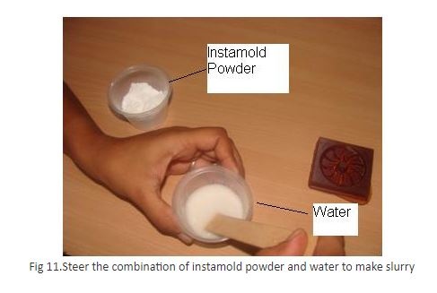

### Procedure
Molding is the process of manufacturing by shaping pliable raw material using a rigid frame or model called a pattern. In this process a pattern of Fan blade is used, which has machined on desktop CNC machine with modeling wax material (Please refer experiment”3D Machining”). The pattern used for making a rubber compound mold is shown in fig-1)

**The material required for urethane rubber molding and casting are:**

1. Urethane Mold compound
2. Rubber Mold Compound
3. Container
4. Stirrer
5. Mold Cavity

**Step-1**

Use liquid rubber compound containing one bottle of Urethane mold compound and Rubber mold compound shown in figure 1.

**Step-2**

Take equal amount of both the compounds as shown in figure 2.

**Step-3**

Mix both urethane and rubber compound thoroughly and gently so that there should not be any air entrapment in the mixture as shown in fig 3, 4 and 5.

**Step-4**

Pour Liquid rubber compound slowly and gently over the milled object make sure that it should raise little above the height of object, After pouring the compound into mold as shown in fig 7.

**Step-5**

Keep object of Poured liquid rubber compound at room temperature for 4 hours, remove mold from object after set time is over, and Remove the solid rubber mold cavity gently from the wax impression

**Step-6**

Mold cavity is ready for pouring of plastic or Instamold or Dry stone powder, in this process Instamold powder is used.

**Step-7**

Mix the powder gently with the water, in such a way that, first take water in a cup add 1/3rd of powder stir it again repeatedly add powder in to the water until it converted into slurry. Never add water in the powder, add powder into the water.

**Step-8**

Now pour the slurry gently into the mold cavity until the mold cavity is fully filled, and Keep the mold cavity for curing up to 1-1:50hr or until it becomes solid.

**Step-9**

Remove the cast part gently from the cavity.

